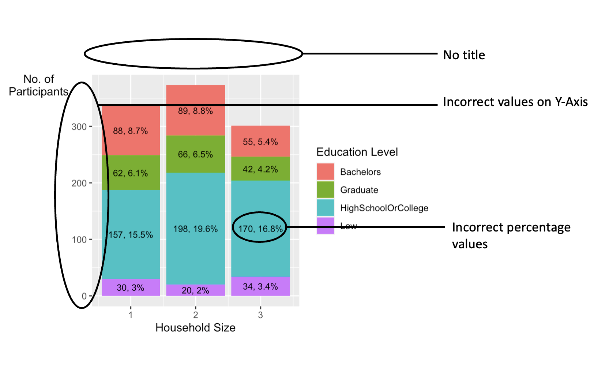
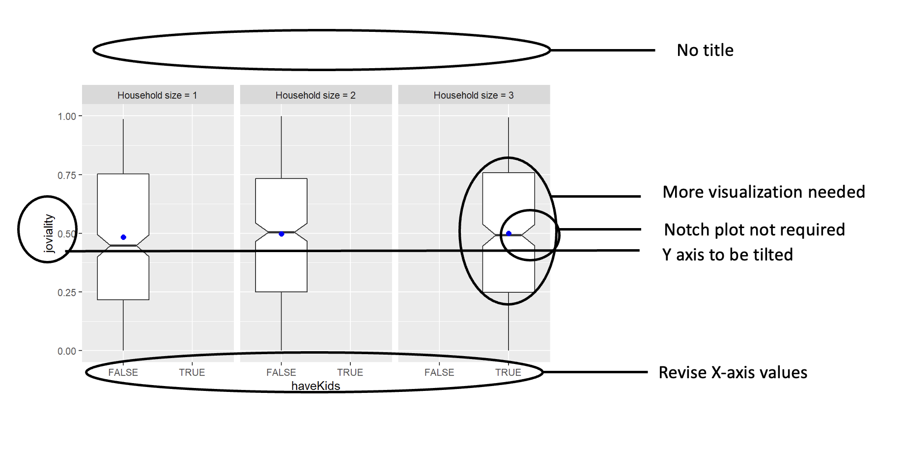
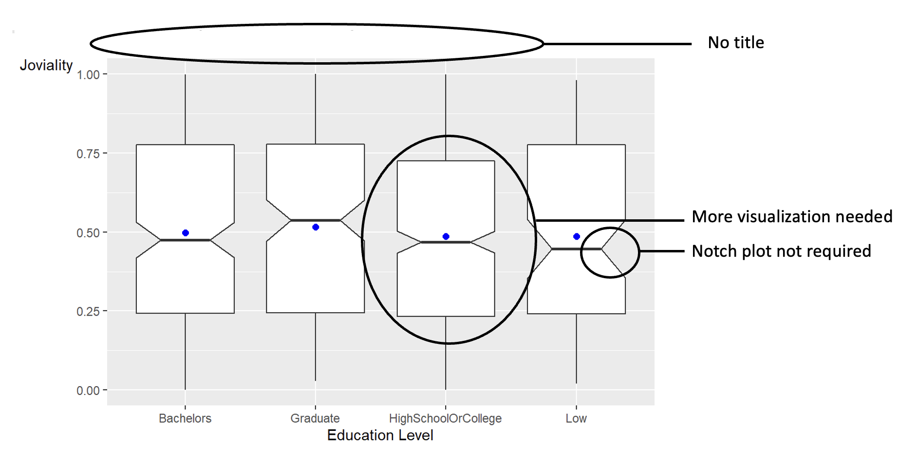
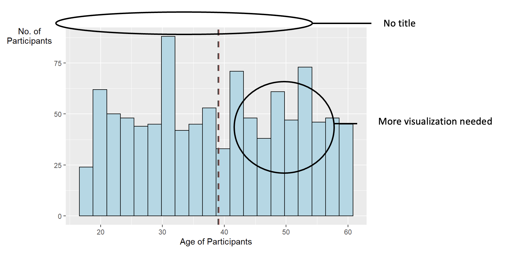

For this exercise, I refer to my collegue, Jeremiah Lam's work-<a href=https://jeremiahlam.netlify.app/th_ex/th_ex1.html> Jeremaih's Take home exercise 1</a>

On reading his work, I observed that he understood the data correctly and drew out appropiate objectives. While he has applied all his learnings from Lesson 1 and 2, based on my understanding, I feel that he could use better visual analytics technique and abide by the principles kept in mind while plotting the graphs. 

I take this opportunity to put in my 2 cents and provide my feedback on his work.

Reading the libraries-

```{r}
packages=c('tidyverse','psych','rmarkdown','ggmosaic','ggpubr','ggridges','ggplot2','patchwork','ggdist')
for (p in packages){
  if(!require(p,character.only=T)){
    install.packages(p)
  }
  library(p,character.only = T)
}

```

# Data Source

```{r,echo=TRUE}
Participants=read_csv("data/Participants.csv",show_col_types = FALSE)
paged_table(Participants)
```

# Feedback 1

### Bargraph depicting the frequency of participants based on household size and education status

<figure>
  
  <figcaption>Fig.1 - Jeremiah Lam's Bargraph </figcaption>
</figure>


### Points of Improvement

1. Stacked bar chart is never recommended to compare totals and parts of whole. An ideal chart would be to show the Household Size vs the proportion of participants in the form of a stacked column chart

2. The percentage values shown in the graph were misleading. Adding up all the percentages would give us 100% while the percentage values should be calculated with respect to the age group.

3. Graph title is missing.

### Rectification

To construct this, we will use a column chart instead of a bar chart with proportion on the y axis and Household size on the x axis.

#### Creating the dataset

```{r}
HS_EducationLevel<-Participants%>%group_by(householdSize,educationLevel)%>%tally()
HS_EducationLevel<-HS_EducationLevel%>%
  group_by(householdSize)%>%
  mutate(Total=sum(n),percent=round(n*100/Total,1))%>%
  ungroup()
paged_table(HS_EducationLevel)


```
#### Visualization

Creating a column chart with Household size as X axis and its corresponding percentage values on the Y axis and hue as education level.

```{r}
ggplot(data = HS_EducationLevel,
       aes(x=householdSize,
           y=percent,
           fill=educationLevel))+
  geom_col()

```
#### Further modifications

1. Adding the right percentage values based on the ones dervied in the dataset.

2. Graph Title,Tilting the Y Axis

3. Changing the theme to make it look 'beautiful'

```{r}
G1<-ggplot(data = HS_EducationLevel,
       aes(x=householdSize,
           y=percent,
           fill=educationLevel))+
  geom_col()+
  geom_text(aes(label=paste0(n,", ",percent,"%")),
            position = position_stack(vjust = 0.5),size=3)+
  theme(axis.text.x  = element_text(angle=0))+
  xlab("Household size")+
  ylab("% of participants")+
  ggtitle("How well educated are the participants?") +
  theme_bw()+
  guides(fill = guide_legend(title = "Education Level"),
         shape = guide_legend(override.aes = list(size = 0.5)))+
  theme(legend.title = element_text(size = 9),
        legend.text = element_text(size = 7),
        axis.title.y=element_text(angle=0))+
  scale_fill_brewer(palette="Set3")
G1
```

### Comparison

Comparing the 2 graphs, we can see that the one on the right helps us understand the observations better as it is correctly plotted with appropiate percentage values.

```{r,echo=FALSE,include=FALSE}
Initialgraph<-ggplot(Participants, aes(x=householdSize, fill = educationLevel)) + 
  geom_bar() + 
  geom_text(stat="count",
            aes(label=paste0(..count..,", ",
                             round(..count../sum(..count..)*100,
                                   1),"%")),
            position = position_stack(vjust = 0.5), size = 3) +
  xlab("Household Size") +
  ylab("No. of\nParticipants") +
  labs(fill = "Education Level") + 
  theme(axis.title.y=element_text(angle=0))
Initialgraph

```

```{r fig.width=15,fig.height=7}
Initialgraph|G1

```

### Walking the extra mile

Since there are 2 categorical variables in question, Mosaic plot can also be explored.A mosaic plot can be understood intuitively: the entire rectangle represents 100% of the observations. The area of each mosaic piece shows the proportion of observations in that category combination. The rest basically works like a stacked bar chart, which should be familiar to the average reader.

```{r}
p<-ggplot(data = Participants) +
  geom_mosaic(aes(x = product(educationLevel,householdSize), 
                  fill=educationLevel))+
  ggtitle('How well educated are the participants?')+
  ylab("Education Level")+
  xlab("Household Size")+
  guides(fill = guide_legend(title = "Education Level"),
         shape = guide_legend(override.aes = list(size = 0.5)))+
  theme_bw()+
  theme(plot.title = element_text(hjust = 0.5,size = 13),
        legend.title = element_text(size = 9),
        legend.text = element_text(size = 7))
p
```

The graph looks incomplete as we are not able to interpret the frequency of the participants in the relevant category. 

To solve this, we are going to use <b>geom_text()</b> and use layer_data() to get the values of each of the plots. 

```{r}
paged_table(layer_data(p,1))

```

From the values extracted from the graph, we are going to use xmax, xmin, ymax and ymin to position the text and use .n as a label on the plot

```{r}
layer_data=layer_data(p, 1) %>% 
      select(xmin:ymax,.n) %>% 
      mutate(m.x = (xmin + xmax)/2, m.y =  (ymin + ymax)/2) %>% 
      select(m.x, m.y,.n,ymax,ymin)
paged_table(layer_data)
```

#### Final Visualization

```{r fig.width=8,fig.height=4}
p<-ggplot(data = Participants) +
  geom_mosaic(aes(x = product(educationLevel,householdSize), 
                  fill=educationLevel))+
  ggtitle('How well educated are the participants?')+
  ylab("Education Level")+
  xlab("Household Size")+
  guides(fill = guide_legend(title = "Education Level"),
         shape = guide_legend(override.aes = list(size = 0.5)))+
  theme_bw()+
  theme(
        legend.title = element_text(size = 9),
        legend.text = element_text(size = 7),
        axis.title.y=element_text(angle=0),
        plot.title = element_text(size = 13)
        )

Mosaic<-p+
  geom_text(
    data = layer_data,
    aes(x = m.x, y = m.y, label = .n)
  )
Mosaic
```

# Feedback 2

### Box plot capturing the joviality of those have kids
<figure>
  
  <figcaption>Fig.2 - Jeremiah Lam's box plot capturing the joviality of those have kids </figcaption>
</figure>

### Points of Improvement

1. Instead of having the original values of True, False for Kids, we can modify it to With Kids, Without Kids

2. The notch plot seems to be redundant and instead box plot can be explored

3. One visualization is not enough. We may need to explore others to get a better understanding.

4. Graph title is missing

5. Y axis could be tilted

### Rectification 

#### Creating the dataset

A new column named 'Kids_Reordered' is created to store the values as With Kids and Without Kids instead of True and False

```{r}
d<-Participants%>%mutate('Kids_Reordered'=
                case_when(haveKids=="TRUE"~"With Kids",
                          haveKids=="FALSE"~"Without Kids"))
paged_table(d)


```
We will be using this dataset for this visual analysis

#### Visualization 

Creating a boxplot with Kids_Reordred on the Y axis and joviality on the X axis. 'Mean' is also added as a stat summary.

```{r}

ggplot(data = d,
       aes(y = joviality, x = Kids_Reordered)) +
  geom_boxplot(width=0.2)+ 
  stat_summary(geom ="point",
              fun.y = "mean",
              colour = "blue",
              size = 2)


```


Adding a Violin Plot to understand the visualization better

```{r}
ggplot(data = d,
       aes(y = joviality, x = Kids_Reordered)) +
  geom_violin(fill="lightgreen")+
  geom_boxplot(width=0.2)+ 
  stat_summary(geom ="point",
              fun.y = "mean",
              colour = "blue",
              size = 2)

```

Using the facet width functionality to add a facet based on household size

```{r}
new <- c("Household size = 1", "Household size = 2", "Household size = 3")
names(new) <- c("1", "2", "3")
ggplot(data = d,
       aes(y = joviality, x = Kids_Reordered)) +
  geom_violin(fill="lightgreen")+
  geom_boxplot(width=0.2)+ 
  stat_summary(geom ="point",
              fun.y = "mean",
              colour = "blue",
              size = 2)+
  facet_wrap(~ householdSize, labeller = labeller(householdSize = new))


```


#### Further modifications

1. Add appropriate X and Y axis labels

2. Graph title

```{r}
G5<-ggplot(data = d,
       aes(y = joviality, x = Kids_Reordered)) +
  geom_violin(fill="lightgreen")+
  geom_boxplot(width=0.1)+ 
  stat_summary(geom ="point",
              fun.y = "mean",
              colour = "blue",
              size = 2)+
  facet_wrap(~ householdSize, labeller = labeller(householdSize = new))+
  xlab("Kids")+
  ylab("Joviality")+
  ggtitle("How happy are participants with kids?")+
  theme(axis.title.y=element_text(angle=0))
G5
```

### Comparison

```{r,echo=FALSE,include=FALSE}
new <- c("Household size = 1", "Household size = 2", "Household size = 3")
names(new) <- c("1", "2", "3")
I2<-ggplot(data = Participants,
       aes(y = joviality, x = haveKids)) +
  geom_boxplot(notch = TRUE) +
  facet_grid(~ householdSize, labeller = labeller(householdSize = new)) + 
  stat_summary(geom ="point",
              fun.y = "mean",
              colour = "blue",
              size = 2)
```

Comparing the initial and the final graph, we see that the latter explains our observations pretty well as it follows the fundamentals of Data Visualization and makes sense logically.

```{r fig.width=15,fig.height=7}
I2+G5
```

### Walking the extra mile

We can try the raincloud model to understand the data with interval as box plot.The dots are kept small in size to read the raw dataset properly and the clouds in green colour for aesthetics purposes.

```{r}
Raincloud<-ggplot(d, aes(y = joviality, x = Kids_Reordered)) + 
  ggdist::stat_halfeye(adjust = .5, width = .3, .width = 0, justification = -.3, point_colour = NA,fill="lightgreen") + 
  geom_boxplot(width = .1, outlier.shape = NA) +
  stat_summary(geom ="point",
              fun = "mean",
              colour = "blue",
              size = 0.5)+
  ggdist::stat_dots(side = "left", dotsize = 0.03, justification = 1.1, binwidth = .1)+
  xlab("Kids")+
  ylab("Joviality")+
  facet_wrap(~ householdSize, labeller = labeller(householdSize = new))+
  ggtitle("How happy are participants with kids?")+
  theme(axis.title.y=element_text(angle=0),
        plot.title = element_text(size=13))
Raincloud
```

### Box plot capturing the joviality based on the education status

<figure>
  
  <figcaption>Fig.3 - Jeremiah Lam's box plot capturing the joviality based on the education status </figcaption>
</figure>

We see some similar observations here as well. Recreating the graph with education level on the x axis.


```{r}
G6<-ggplot(data = Participants,
       aes(y = joviality, x = educationLevel)) +
  geom_violin(fill="lightgreen")+
  geom_boxplot(width=0.1) +
  geom_point(stat="summary",
             fun.y="mean",
             colour='red',size=1) +
  ylab("Joviality") +
  xlab("Education Level") +
  ggtitle("Is Education status the reason behind happiness?")+
  theme(axis.title.y=element_text(angle=0))
G6
```

### Comparison

```{r,echo=FALSE,include=FALSE}
I6<-ggplot(data = Participants,
       aes(y = joviality, x = educationLevel)) +
  geom_boxplot(notch = TRUE) +
  stat_summary(geom ="point",
              fun.y = "mean",
              colour = "blue",
              size = 2) +
  ylab("Joviality") +
  xlab("Education Level") +
  theme(axis.title.y=element_text(angle=0))
```

Comparing the initial and the final graph, we see that the latter explains our observations pretty well as it follows the fundamentals of Data Visualization and makes sense logically.

```{r fig.width=15,fig.height=7}
I6+G6
```

### Walking the extra mile

We can explore the density ridges (using the geom_density_ridges2() function) to understand the joviality for participants of various educational background


```{r}
ggplot(data = d,
       aes(x = joviality, y = educationLevel)) +
  geom_density_ridges2()


```

Further modifications:

1. Adding a gradient to understand the increase the joviality 

2. Expanding the x and y axis scale

3. Modifying the x and y axis title

4. Graph title

```{r fig.width=8,fig.height=4}
RidgePlot<-ggplot(data = d,
       aes(x = joviality, y = educationLevel,fill=stat(x))) +
  geom_density_ridges_gradient(scale = 2, rel_min_height = 0.01) +
  scale_fill_viridis_c(name = "Joviality", option = "D")+
  facet_wrap(~Kids_Reordered)+
  scale_x_continuous(expand = c(0, 0)) +
  scale_y_discrete(expand = c(0, 0)) +
  coord_cartesian(clip = "off")+
  xlab("Joviality")+
  ylab("Education Level")+
  ggtitle("Is Education Status the reason behind happiness?")+
  theme(axis.title.y=element_text(angle=0),
        plot.title = element_text(size=13))
RidgePlot

```

# Feedback 3

### Age Distribution Graph

<figure>
  
  <figcaption>Fig.4 - Jeremiah Lam's age distribution graph</figcaption>
</figure>


### Points of Improvement

1. More visualization techniques could be added

2. Graph has missing title

### Rectification

#### Visualization
```{r}
ggplot(data=Participants, 
       aes(x= age)) +
  
  geom_histogram(bins=10,
           aes(y=..density..),
                 colour="black",fill="white")+
  geom_density(alpha=.2)+
  
  ylab("Density") +
  xlab("Age of Participants")

```

We can add a title to the graph and along with it, add some asthetics to make it more presentable.

```{r}
ggplot(data=Participants, 
       aes(x= age,y=..density..)) +
  
  geom_histogram(bins=10,
           aes(y=..density..),
                 colour="lightgray",fill="lightgray")+
  geom_density(alpha=.2,colour="black",fill="pink")+
  ggtitle("Age Distribution")+
  
  ylab("Density") +
  xlab("Age of Participants")
```

### Walking the extra mile

We can make use of the lollipop chart to depict the 25th,50th and 75th percentile. 

For this, we would be using geom_segment() to create a line and use geom_point() to create the circle to make it a lollipop chart.

```{r}
G3<-ggplot(data=Participants, 
       aes(x= age,y=..density..)) +
  
  geom_histogram(bins=10,
           aes(y=..density..),
                 colour="lightgray",fill="lightgray")+
  geom_density(alpha=.2,colour="black",fill="pink")+
  ggtitle("Age Distribution")+
  
  geom_segment(aes(na.rm=T,x = mean(age),
                   xend = mean(age), 
                   y = 0, 
                   yend = 0.025),
             color="red",
             linetype='dashed',
             size=1,lwd = 1) +
  geom_segment(aes(na.rm=T,x = quantile(age,prob=c(0.25)), 
                   xend = quantile(age,prob=c(0.25)), 
                   y = 0,
                   yend = 0.025),
             color="grey30",
             linetype='solid',
             size=1,lwd = 1) +
  
  geom_point(aes(x=quantile(age,prob=c(0.25)),
                 y=0.025),
             size = 4,
             pch = 21,
             bg = 4,
             col = 1) +
  
  geom_segment(aes(na.rm=T,x = quantile(age,prob=c(0.5)), 
                   xend = quantile(age,prob=c(0.5)), 
                   y = 0, 
                   yend = 0.025),
             color="grey30",
             linetype='solid',
             size=1,lwd = 1) +
  
  geom_point(aes(x=quantile(age,prob=c(0.5)),y=0.025),
             size = 4, 
             pch = 21, 
             bg = 4, 
             col = 1) +
  geom_segment(aes(na.rm=T,x = quantile(age,prob=c(0.75)),
                   xend = quantile(age,prob=c(0.75)), 
                   y = 0, 
                   yend = 0.025),
             color="grey30",
             linetype='solid',
             size=1,lwd = 1) +
  
  geom_point(aes(x=quantile(age,prob=c(0.75)),
                 y=0.025),
             size = 4,
             pch = 21,
             bg = 4,
             col = 1) +
  ylab("Density") +
  xlab("Age of Participants") +
  theme(axis.title.y=element_text(angle=0))+
  theme_minimal()
G3
```

Labeling all the lines to make it aesthetically pleasing and reducing the thickness of the lines

```{r}
G3<-ggplot(data=Participants, 
       aes(x= age,y=..density..)) +
  
  geom_histogram(bins=10,
           aes(y=..density..),
                 colour="lightgray",fill="lightgray")+
  geom_density(alpha=.2,colour="black",fill="pink")+
  ggtitle("Age Distribution")+
  
  geom_segment(aes(na.rm=T,x = mean(age),
                   xend = mean(age), 
                   y = 0, 
                   yend = 0.025),
             color="red",
             linetype='dashed',
             size=0.2,lwd = 1) +
  geom_segment(aes(na.rm=T,x = quantile(age,prob=c(0.25)), 
                   xend = quantile(age,prob=c(0.25)), 
                   y = 0,
                   yend = 0.025),
             color="grey30",
             linetype='solid',
             size=0.2,lwd = 1) +
  
  geom_point(aes(x=quantile(age,prob=c(0.25)),
                 y=0.025),
             size = 4,
             pch = 21,
             bg = 4,
             col = 1) +
  
  geom_segment(aes(na.rm=T,x = quantile(age,prob=c(0.5)), 
                   xend = quantile(age,prob=c(0.5)), 
                   y = 0, 
                   yend = 0.025),
             color="grey30",
             linetype='solid',
             size=0.2,lwd = 1) +
  
  geom_point(aes(x=quantile(age,prob=c(0.5)),y=0.025),
             size = 4, 
             pch = 21, 
             bg = 4, 
             col = 1) +
  geom_segment(aes(na.rm=T,x = quantile(age,prob=c(0.75)),
                   xend = quantile(age,prob=c(0.75)), 
                   y = 0, 
                   yend = 0.025),
             color="grey30",
             linetype='solid',
             size=0.2,lwd = 0.5) +
  
  geom_point(aes(x=quantile(age,prob=c(0.75)),
                 y=0.025),
             size = 4,
             pch = 21,
             bg = 4,
             col = 1) +
     geom_text(aes(x=quantile(age,prob=c(0.25)), 
                   label="25th percentile",y=0), 
               colour="black", 
               angle=90, 
               text=element_text(size=2),
               hjust = -1,
               vjust = -1)+
     geom_text(aes(x=quantile(age,prob=c(0.75)),
                   label="75th percentile",y=0),
               colour="black",
               angle=90,
               text=element_text(size=2),
               hjust = -1,
               vjust = -1)+
  geom_text(aes(x=quantile(age,prob=c(0.5)),
                   label="50th percentile",y=0),
               colour="black",
               angle=90,
               text=element_text(size=2),
               hjust = -1,
               vjust = -1)+
  geom_text(aes(x=mean(age)+2,
                   label="Mean",y=0),
               colour="red",
               angle=90,
               text=element_text(size=2),
               hjust = -1,
               vjust = -1)+
  ylab("Density") +
  xlab("Age of Participants") +
  
  theme_minimal()+
  theme(axis.title.y=element_text(angle=0))
G3
```

### Comparison

```{r echo=FALSE,include=FALSE}
I3<-ggplot(data=Participants, 
       aes(x= age)) +
  geom_histogram(bins=20,
                 color = 'black',
                 fill='light blue') +
  geom_vline(aes(xintercept=mean(age,
                                 na.rm=T)),
             color="red",
             linetype='dashed',
             size=1) +
  geom_vline(aes(xintercept=median(age,
                                 na.rm=T)),
             color="grey30",
             linetype='dashed',
             size=1) +
  ylab("No. of\nParticipants") +
  xlab("Age of Participants") +
  theme(axis.title.y=element_text(angle=0))

```

On comparing the 2 graphs, we see that the latter helps us understand the density,distribution and also some statistics such as the quartiles and mean.

```{r fig.width=15,fig.height=7}
I3+G3
```

# Conclusion

While it was a good attempt, I was able to identify some voids which could be filled to make it better and more visually appealing to the reader and follow some of the principles and fundamental concepts which were discussed by some learned individuals

```{r fig.width=15,fig.height=7}
(Mosaic/RidgePlot)|(Raincloud/G3)
```